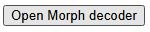

[](https://www.repostatus.org/#active)  [](https://tonyjurg.github.io/Sandborg-Petersen-decoder/)  [](https://doi.org/10.5281/zenodo.14551056) [](https://archive.softwareheritage.org/browse/origin/?origin_url=https://doi.org/10.5281/zenodo.14551056) [](https://creativecommons.org/licenses/by/4.0/)

# Sandborg-Petersen Morphology Decoder

This lightweight decoder implements the Sandborg-Petersen morphology schema for Koine Greek — especially New Testament and related texts — in a simple, browser-based tool.

You can try it online at [https://tonyjurg.github.io/Sandborg-Petersen-decoder/](https://tonyjurg.github.io/Sandborg-Petersen-decoder/). 
The online version allows also allows for prefilling the decoder with a specific tag by appending `?tag=<TAG>` (for example, <a href="https://tonyjurg.github.io/Sandborg-Petersen-decoder/?tag=N-NSF" target="_blank">`?tag=N-NSF`</a>).

# Decoder formats

Two functionaly equivalent coding implementations are stored on this repository:

   - [HTML with javascript based decoder](https://github.com/tonyjurg/Sandborg-Petersen-decoder/blob/main/javascript/SP-Morph-decode.html)
   - [Python](https://github.com/tonyjurg/Sandborg-Petersen-decoder/blob/main/python/SP-Morph-decode.py)

# Definitional document
 
A descriptive document with parsing information is available via [github.com/biblicalhumanities](https://github.com/biblicalhumanities/Nestle1904/blob/master/morph/parsing.txt).

# Integrating in HTML page

## Using a JavScript generated button

Because the decoder requires JavaScript to function, it is reasonable to embed a link to it directly in any HTML page using a method depending on JavaScript as well. This approach also lets you open it in a new, resizable window of a specified size.

The first step is to add a script anywhere inside your &lt;HEAD&gt; section, or at the top of your &lt;BODY&gt; section:

``` html
 <SCRIPT>
    function openMinimalWindow() {
      window.open(
        'https://tonyjurg.github.io/Sandborg-Petersen-decoder/',
        '_blank',
        'toolbar=no,location=no,status=no,menubar=no,scrollbars=yes,resizable=yes,width=800,height=600'
      );
    }
  </SCRIPT>

```
 In the &lt;BODY&gt; section include the following:
 
 ``` html

 <BUTTON onclick="openMinimalWindow()">Open Morph decoder</button>
 
 ```

This will put a button on your page similair to the image below:



If JavaScript is enabled, clicking this button will launch the decoder in a new 800×600 px window without toolbars or menus.

## Adding a direct link

If you prefer a simple hyperlink that opens in a full browser tab, just use:

```html
  <A HREF="https://tonyjurg.github.io/Sandborg-Petersen-decoder/" TARGET="_blank">Open Morph decoder</A>
```

## Open decoder for a specific tags

You can also open the decoder pre-filled for a specific tag by appending a `tag` query parameter to its URL. In our HTML/JavaScript implementation, a small script reads the URL’s `tag` parameter and uses it to initialize the decoder, which is especially handy if you’ve already run your analysis in Python. 

In the following Python code we make the tag column in a dataframe clickable to fire off the analysis tool.

```python
import pandas as pd
from IPython.display import HTML

base_url = "https://tonyjurg.github.io/Sandborg-Petersen-decoder/?tag="

# Simple example data
results = [
    ("Βίβλος", "N-NSF"),
    ("λόγος",  "N-NSM"),
    # …
]

# Build dataframe
df = pd.DataFrame(results, columns=["Word", "Tag"])
# Embed clickable HTML links in the 'Tag' column
df["Tag"] = df["Tag"].apply(lambda tag: f'<a href="{base_url}{tag}" target="decoder">{tag}</a>')

# Display as an HTML table with clickable links
HTML(df.to_html(escape=False, index=False))
```
Note the use of `target="decoder"` would normally reuse a single named window. However, in a sanitized environment like Jupyter Notebook, each click opens a new window because Jupyter’s security model isolates browsing contexts. In contrast, when you save the same HTML locally (or serve it as a regular web page), clicks targeting the same window name correctly reuse that single window.

# Tag validation agains MACULA GNT dataset

 - See notebook: [Check SP-Morphs in MACULA XML dataset against documentated tags](testing/SP-Morphs-used-in-MACULA.ipynb).

# Acknowledgements

- ['Parsing Information for Robinson-like parsing tags Adapted from Ulrik Sandborg-Petersen's Description for Tischendorf 8th'](https://github.com/biblicalhumanities/Nestle1904/blob/master/morph/parsing.txt).
